<div align="center">

# 👋 Hey, I'm Rohan Yadav

### `Full-Stack Developer` · `Java & DSA` · `Computer Science Undergraduate`

<p>
  <a href="https://linkedin.com/in/rohanydv530">
    
  </a>
  <a href="mailto:yadavbhoupander@gmail.com">
    
  </a>
</p>


</div>

---

## 🚀 About Me

```javascript
const rohan = {
    education: "B.Tech CSE @ AKGEC | 2024 - 2028",
    location: "Ghaziabad, India",

    currentlyLearning: [
        "Full-Stack Development",
        "Data Structures & Algorithms",
        "Data Science & Machine Learning"
    ],

    development: {
        frontend: ["React", "Redux", "Context API"],
        backend: ["Node.js", "Express.js", "REST APIs"],
        database: ["MongoDB", "Mongoose", "Redis"],
        languages: ["Java", "JavaScript", "HTML", "CSS"]
    },

    coreConcepts: [
        "DSA",
        "OOP",
        "DBMS",
        "REST APIs",
        "JWT Authentication",
        "CRUD"
    ],

    interests: [
        "Building scalable web applications",
        "Backend development",
        "Problem solving",
        "Machine Learning"
    ],

    mindset: "Learn → Build → Break → Fix → Improve 🚀"
};
```

> 💡 I enjoy turning ideas into functional applications while continuously improving my skills in software development, DSA, backend systems, and machine learning.

---

# 💻 Tech Stack

### 👨‍💻 Languages

<p>
  
</p>

### ⚛️ Frontend Development

<p>
  
</p>

### ⚙️ Backend Development

<p>
  
</p>

### 🗄️ Databases & Caching

<p>
  
</p>

### 🛠️ Tools

<p>
  
</p>

### 🧠 Core Concepts

<p>
  
  
  
  
  
  
</p>

---

# 🔥 Featured Projects

<table>
<tr>

<td width="50%">

## 📁 File Upload & Authentication Platform

### `MERN Stack · JWT · MongoDB`

A full-stack web application focused on authentication, file management, and user profiles.

### ✨ Features

- 🔐 JWT authentication
- 👤 User registration & login
- 🛡️ Protected routes
- 📤 File upload & management
- 👨‍💻 Editable user profiles
- 📱 Responsive React interface
- 🗄️ MongoDB data persistence

</td>

<td width="50%">

## ✍️ Blogify

### `Node.js · Express.js · MongoDB`

A blogging platform built with Express.js and MongoDB.

### ✨ Features

- 📝 Create & manage blogs
- 🔄 CRUD operations
- 🗃️ Mongoose data modeling
- 🚀 Express.js routing
- 💾 MongoDB persistence
- 🧩 Structured backend architecture

</td>

</tr>

<tr>

<td width="50%">

## ✅ Todo Application

### `React · Redux`

A responsive task management application using Redux for predictable global state management.

### ✨ Features

- ➕ Add tasks
- ✏️ Update tasks
- ✅ Complete tasks
- 🗑️ Delete tasks
- ⚛️ Reusable React components
- 🔄 Redux state management

</td>

<td width="50%">

## 💱 Currency Calculator

### `React · Context API · Hooks`

A React application demonstrating centralized state management and reusable application logic.

### ✨ Features

- ⚛️ React Hooks
- 🌐 Context API
- 🔄 Shared state management
- 🧩 Reusable components
- 📱 Responsive interface

</td>

</tr>
</table>

---

# 🧠 What I'm Currently Working On

<div align="center">

```text
╔══════════════════════════════════════════════════════╗
║                                                      ║
║   🔨 Building full-stack MERN applications           ║
║                                                      ║
║   🧩 Strengthening DSA with Java                     ║
║                                                      ║
║   ⚙️ Learning backend architecture                   ║
║                                                      ║
║   🗄️ Exploring databases & caching                  ║
║                                                      ║
║   🤖 Exploring Data Science & Machine Learning       ║
║                                                      ║
║   🚀 Building projects and improving every day       ║
║                                                      ║
╚══════════════════════════════════════════════════════╝
```

</div>

---

# 🏆 Certifications

| 🏅 Certification | 🏢 Issuer |
|---|---|
| 🟢 **Redis Associate Developer** | Redis |
| 🌐 **Web Development** | Apna College |
| 🧩 **Data Structures & Algorithms** | Apna College |
| 🤖 **AI/ML Workshop** | Bharat Space Research Education Center |

---

# 💼 Experience

### 🔬 Data Science & Machine Learning Intern

**Ajay Kumar Garg Engineering College**

- 📊 Worked with foundational **Data Science & Machine Learning** concepts.
- 🧹 Performed **data preprocessing** and **exploratory data analysis (EDA)** on practical datasets.
- 🤖 Applied **Machine Learning concepts** to practical datasets and problem scenarios.
- 💻 Strengthened practical understanding through **hands-on implementation and experimentation**.

---

# 🎓 Education

### 🏫 Ajay Kumar Garg Engineering College — Ghaziabad

**Bachelor of Technology — Computer Science & Engineering**

📅 **2024 — 2028**

🎯 **SGPA: 8.07 / 10** *(up to 4th semester)*

---

# 🌟 Beyond Code

- 👨‍💻 Member of **Technical Society — AKGEC**
- 🤝 Member of **Slum Swaraj Society — AKGEC**
- 🧠 Interested in **DSA, backend systems & software development**
- 🚀 Enjoy building projects while learning new technologies

---

# 📊 GitHub Stats

<div align="center">





</div>

# 🔥 Contribution Streak

<div align="center">


</div>

---

# 📈 Contribution Graph

<div align="center">
  
</div>

# 🐍 Watch My Contributions Get Eaten

<div align="center">


</div>

---

# 💬 Let's Connect

<div align="center">

### 💻 Building. Learning. Improving. Repeating.

I'm always interested in connecting with developers, collaborating on projects, and learning something new.

<br>

<a href="https://linkedin.com/in/rohanydv530">
  
</a>

&nbsp;

<a href="mailto:yadavbhoupander@gmail.com">
  
</a>

<br><br>

⭐ **If you find something interesting in my repositories, feel free to star it!**

</div>

---

<div align="center">

### `while(alive) { learn(); build(); improve(); }`

</div>
